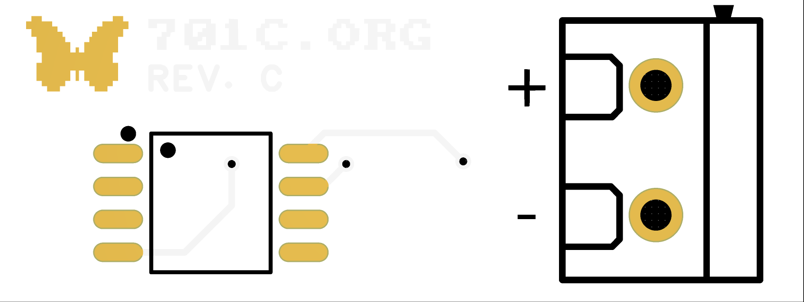
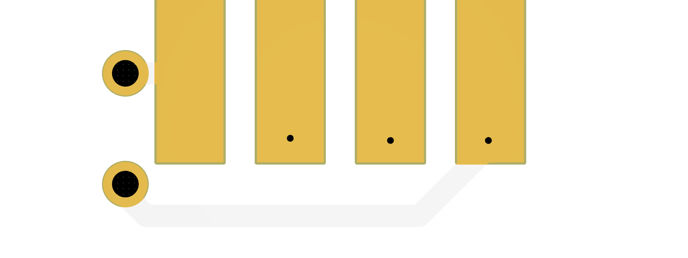

# 👾 701c.org / Battery / PCB  

Find the full rebuild and walkthrough at [https://701c.org/projects/battery](https://701c.org/projects/battery).

Use the gerber files to print your own PCBs at vencors like [PCBWay](https://pcbway.com) or [JLPCB](https://jlpcb.com).

#

#

> If you would prefer to purchase a single board rather than printing them yourself, you can do so at the [701C.org Shop](https://701c.org/shop).

## Example Printer Settings

| Property      | Value |
| ----------- | ----------- |
| Layers | 2 |
| Width      | 31 mm     |
| Height   | 11.6 mm      |
| Thickness | 1 mm |
| Finish | ENIG (Immersion gold) |

## Required Components

| Component | Part # |
| --- | --- |
| Terminals | KF301-2P 5.08mm |
| MCU | [ATTINY85-20SF](https://www.findchips.com/search/ATTINY85-20SF) or [ATTINY85-20SFR](https://www.findchips.com/search/ATTINY85-20SFR) |

The code for the MCU can be found [here](https://github.com/hrushka/701c.org/tree/main/src/ds2434). 